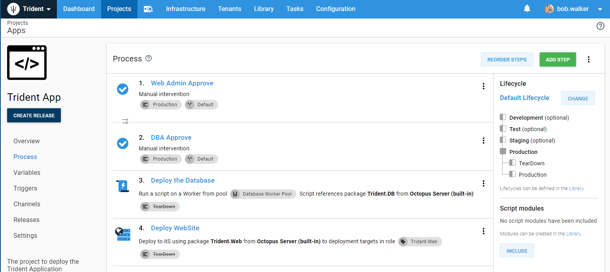

# Configuring Octopus Deploy to leverage Infrastructure as Code

The previous section addressed some core concepts as well as some recommendations to consider when you are getting started with IaC.  In this section, we want to discuss some configuration changes you will need to make to Octopus Deploy to support Infrastructure as Code.

## Environments and Lifecycles

Your scenario will influence your environment and lifecycle configuration.  Especially f you are going to be running your IaC process through Octopus Deploy.  We recommend running your IaC process through Octopus Deploy.  However, you might be leveraging technology such as auto-scaling groups or virtual machine scale sets.  In that case, it doesn't make sense to go through Octopus Deploy.  

If you are running your IaC process through Octopus Deploy, we recommend creating a `TearDown` environment.  In your IaC process, you will deploy to that environment to de-register any deployment targets from Octopus Deploy and to delete the resources.  Creating that environment will require you it to your lifecycles.  For example, if you wanted to scale out production, your lifecycle for that would be:

1. Production
2. TearDown

When you introduce IaC into your process, you will also have to deal with failures.  Typically, most failures will occur the first time you configure your IaC process.  Although rare, a random failure when deploying IaC to Azure or AWS is possible.  We have seen ARM templates deploy half the resources and then fail.  There is no rhyme or reason why failures occurs; it just happens.  You will want to mark any phases before TearDown as optional.  That will allow you to destroy those created resources and quickly try again.

Finally, you will want to configure your Octopus to support dynamic infrastructure for each of your environments.  That is accomplished by going to Infrastructure -> Environments and then clicking on the `...` and selecting Edit.  

## Naming Conventions

You will have to have unique names for everything, especially if you are using active directory or a cloud provider.  While it is possible to get away with assigning every resource a GUID, it isn't something we'd recommend.  It is essential to have clear, concise, naming conventions when using IaC to easily and quickly identify your resources.  Especially when you spinning up and down VMs.  Even though the resource is short lived, you will still want to be able to remote into a VM to debug issues.  

We have found the following naming convention works for a lot of user cases, [Environment Abbreviation]-[Application Abbreviation]-[Resource Purpose]-[Number].  For example, for web servers hosting the OctoFX application:

- Production: p-, IE `p-octofx-web-01` and `p-octofx-web-02`
- Staging: s-, IE `s-octofx-web-01` and `s-octofx-web-02`
- Testing: p-, IE `t-octofx-web-01`
- Development: d-, IE `d-octofx-web-01`

A  really cool feature of Octopus Deploy is variables are calculated at run-time.  That means you can reference a variable in from your project a library variable set.  For example, here is the library variable set "Global," which references the variable, `Project.Application.Name.`

That variable is defined in the projects.

Our recommendation is to create a library variable set or sets to store your naming convention.  In your project have a standard variable or variables, such as `Project.Application.Name,` defined which can be referenced by the library variable set.

## Deployment Process

We've talked about environments, lifecycles, and naming conventions.  Now we can move onto projects.  Regardless of your scenario, your IaC process will typically contain the following steps when spinning up new infrastructure:

1. Create new infrastructure resources.
2. Register new deployment targets with Octopus Deploy.
3. Deploy to new deployment targets.

If your scenarios need to tear down the infrastructure when it is no longer needed, then you need to do the following:

1. De-register the deployment targets with Octopus Deploy.
2. Destroy or teardown any new infrastructure resources.

If you did this all in a single project your deployment process would look something like this:

Depending on your scenario, it is entirely possible for those steps to occur outside of Octopus Deploy.  If you were leveraging [Virtual Machine Scale Sets](https://docs.microsoft.com/en-us/azure/virtual-machine-scale-sets/overview) in Azure or [Auto Scaling Groups](https://docs.aws.amazon.com/autoscaling/ec2/userguide/AutoScalingGroup.html) in AWS, the cloud providers would spin up and down your infrastructure.  You would need to configure the bootstrap script to register the new machines.  When it comes to destroying the machines, you would call and an Azure Function or AWS Lambda function to call the Octopus API to de-register the machines from Octopus Deploy.

In other scenarios, it makes sense to leverage Octopus Deploy with IaC.  Octopus Deploy has built in steps to deploy Azure Resource Manager (ARM) templates, Cloud Formation Templates - for AWS.  Octopus Deploy also supports TerraForm templates - which can deploy to both Azure and AWS.  If we don't provide the built-in steps, you can easily script them out using PowerShell or Bash.  If you go that route, check out our [community library](https://library.octopus.com) to see if someone from the community has written something.  

## Deployment Target Triggers

The final piece of the puzzle will be getting the latest and greatest code deployed to the new deployment targets after they are created.  That is accomplished by [deployment target triggers](https://octopus.com/docs/deployment-process/project-triggers/automatic-deployment-triggers) in Octopus Deploy.  For example, with this trigger, it will deploy the latest release in production when a web server is found with the role `Trident-Web.`

In the above screenshot, the trigger is only worried about web servers.  However, the deployment process has manual interventions and a database deployment.  When that trigger runs, steps 1, 2, and 3 should be skipped.  The deployment was already approved when it first went out.  It doesn't make sense to redeploy the database changes as they have already gone out as well.  

We have introduced a new system variable in Octopus Deploy called `Octopus.Deployment.Trigger.Name.`  That variable contains the name of the trigger (when a trigger started the deployment).  Using Octopus Deploy's run conditions, we can prevent steps 1, 2, and 3 from running when a trigger started the deployment.  

It is a bit of a double negative.  How to read that is: when a person or a service account start a deployment, run this step.  When a trigger triggers it, skip this step.

### Deployments with no targets

It is common for targets to be created as part of a deployment.  By default, Octopus Deploy will not allow that.  When Octopus Deploy was created, it was written with the assumption the servers would always be there.  If the servers were not there, then throw an error because something terrible has happened.  Some of our customers still expect that behavior; we didn't want to break them.  We introduced the project setting to allow releases to be deployed if no targets were present.  If your scenario has Octopus Deploy creating the deployment targets as part of the deployment, then you will need to enable this setting.  

