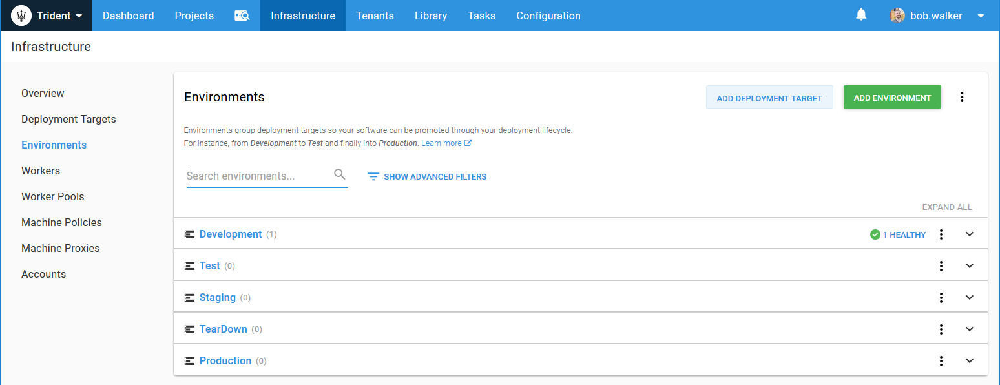
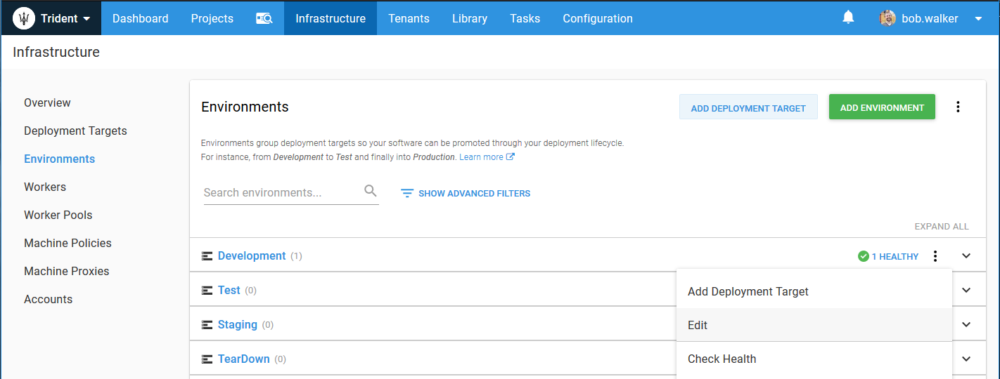
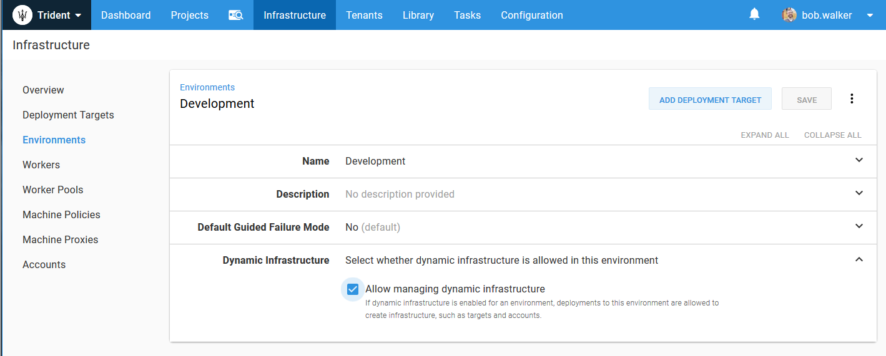
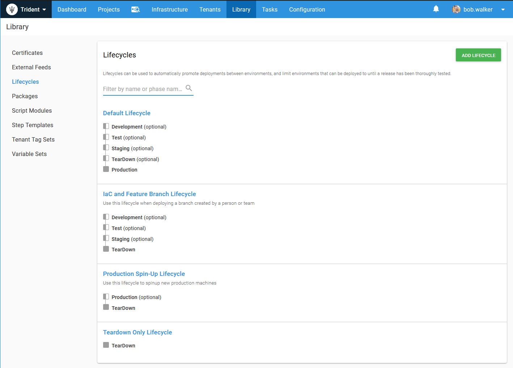
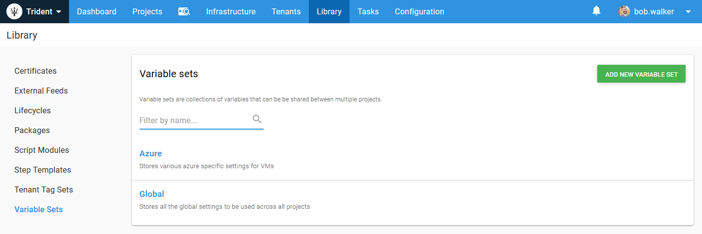
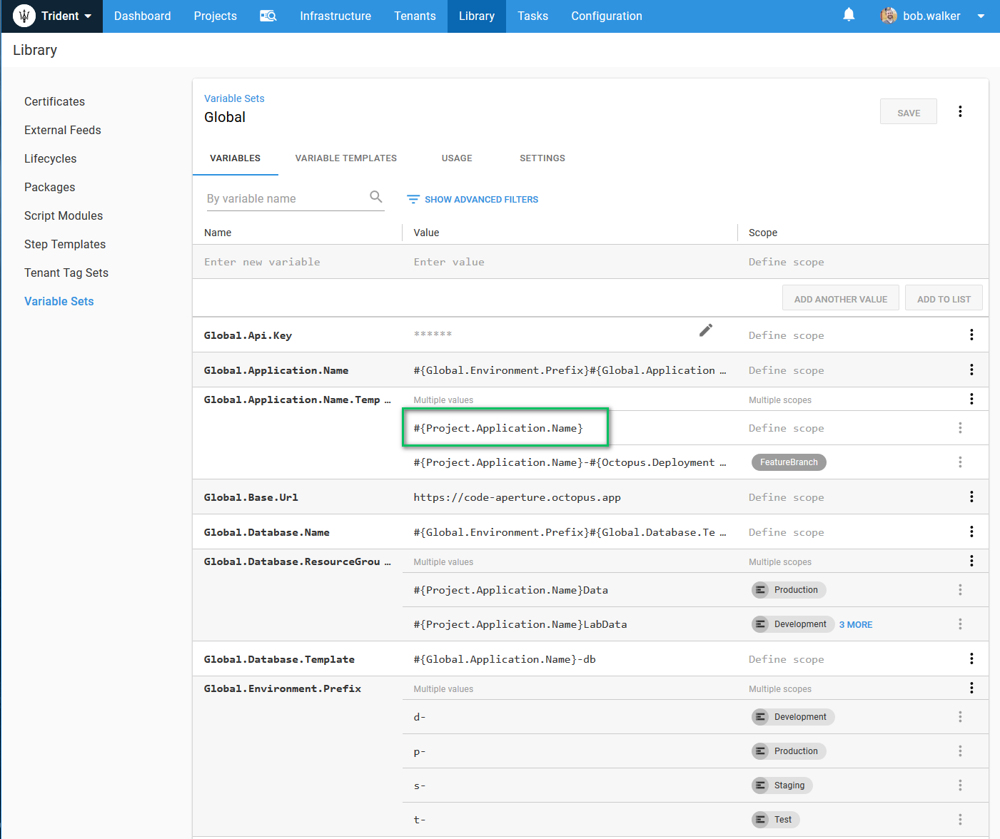
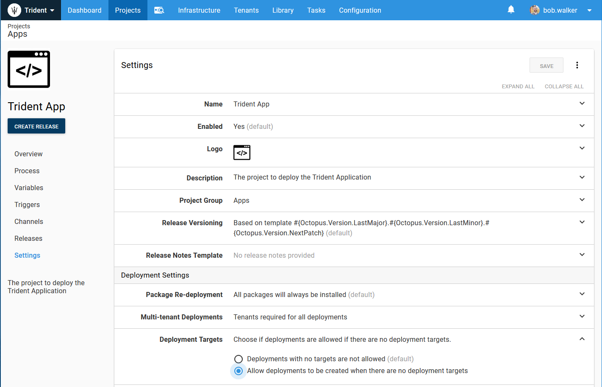
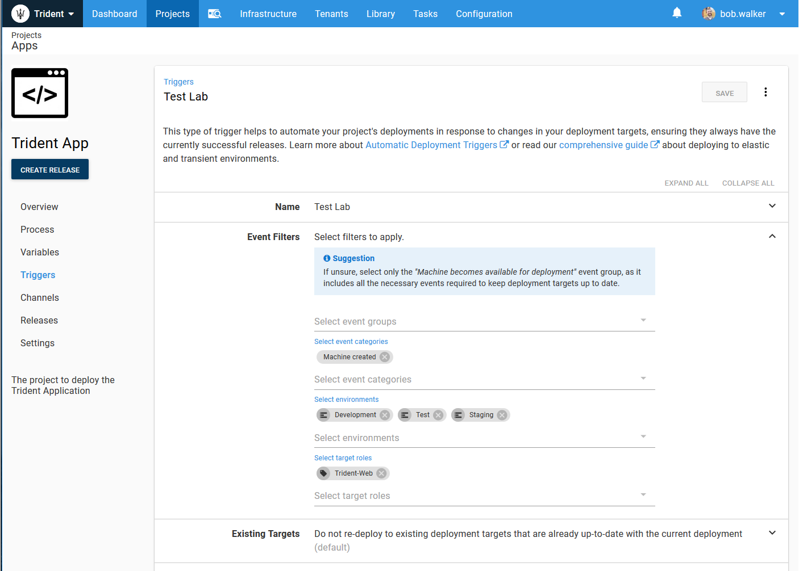
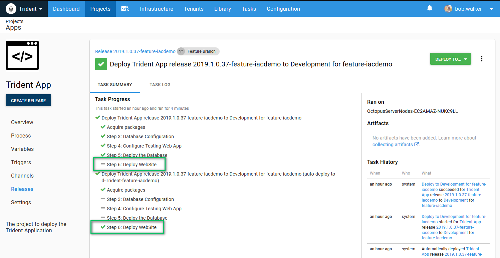
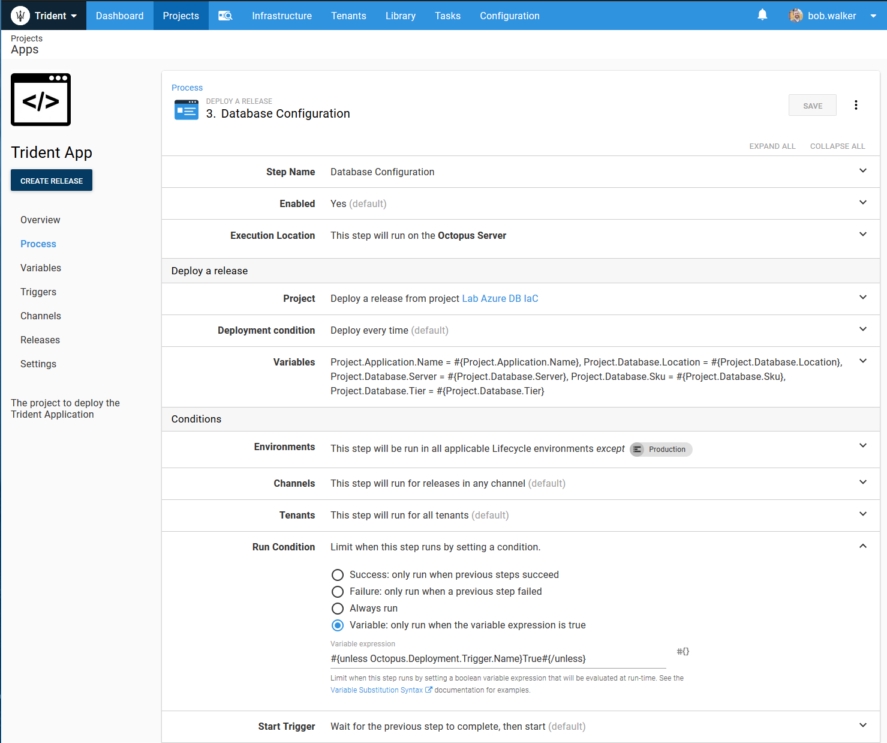

# KCDC IaC Sample Scripts
Sample project containing all the scripts used in the IaC demo for KCDC

## Configuring Infrastructure as Code in Octopus Deploy

Regardless of your scenario, you are going to have to make some configuration changes to Octopus Deploy to support infrastructure as code.

### Environment Configuration

I added a `TearDown` environment.  This allows me to have a step in my lifecycle where I can tear down all the infrastructure Octopus built up.

In addition to adding the `TearDown` environment, I also configured each environment to allow for dynamic infrastructure.  This is accomplished by clicking on the `...` next to each environment.

Then in that screen, checking the checkbox for `Allow managing dynamic infrastructure.`

### Lifecycle Configuration

I changed existing lifecycles or added new lifecycles to support infrastructure as code.  My updated lifecycles are:

1) Default Lifecycle -> handles deployments to the `master.`  All environments except `Production` are optional as I might want to deploy from Dev to Prod or from Dev to TearDown.  
2) IaC and Feature Branch Lifecycle -> handles deployments to feature branches and all IaC projects.
3) Production Spin-Up Lifecycle -> handles scenarios when I need to spin up a bunch of production machines to handle additional load.  
4) TearDown Only -> Primarily used for extra clean-up.  In my case it is cleaning up any remnants of feature branches deployments.

When you are working through your scenarios your lifecycles might be very different.  Think through your use cases and try to make them as easy as possible to follow.

### Variable Sets

You will need to solve a number of different problems with IaC.  First on the docket is naming conventions.  It is important for everyone in your company to follow a standard naming convention.  The easiest way to do this is to use variable sets.  I have two variable sets, one for global, which contains naming conventions, and another for Azure.  

One of the cool things about Octopus Deploy is it resolves a lot of variables at run time.  This means I can have a variable in a library variable set which is set via the project.  In this case, I am going to set the variable Project.Application.Name in the project, but I can use it in the global variable set.

### Project Configuration

To support infrastructure as code, there are going to be a couple of changes we need to make to the project.  First we need to configure it to support releases without any deployment targets.  You might be spinning up deployment targets as part of the deployment.

Next we want to configure a trigger to handle when a new machine is added.  The machine could be added as part of the deployment.  Or, it could be added via another project.  Or, by an outside source.  The point is, you want a trigger to fire when the machine is created or added.  This is the trigger to handle Azure Web Apps being added.  Make note of the machine event.  You will want to tweak that based on what you are adding.

1) PaaS -> `Machine Created`
2) VMs -> `Machine Found Healthy`, `Machine Enabled`, or `Machine found to have warnings`

This is a trigger in action.  The machine was added as part of the deployment.  Octopus didn't see it when it was added.  But seconds later it saw it.

When the trigger fires we only want to run steps which will deploy to the target which was added.  If you look at the screenshot above you will see a lot of `-` next to the steps.  That happened because in each of those steps I configured the variable run condition to be.

`#{unless Octopus.Deployment.Trigger.Name}True#{/unless}`

## Scenario

The demo used for KCDC was to solve the age old problem of "how can I test my changes without stepping on everyone's toes?"  What we will configure Octopus and the build server to do is:

1) Create infrastructure (web application and database) per feature branch
2) Configure Octopus to deploy that feature branch to multiple environments (depending on the scenario)
3) Tear down the infrastructure when the code has been merged into master

