# Scaling out Production Example

Scaling out virtual machines is commonly associated with an increase in traffic.  Sometimes that increase in traffic is known ahead of time.  If you work in retail, then you know the holiday season has an increase in traffic.  Or, when a general election occurs.  Sometimes you don't know when a spike in traffic will occur.  It could be a random social media post or article written about your product.  

Typically, we see companies manually scale up their infrastructure when they know an increase in traffic will occur.  They want to ensure they have capacity to handle that, and the best way to ensure there is capacity is to set it up and test it.  The holiday season is important to a retail company, and they want to ensure a smooth experience for their users.  New virtual machines are created a month or so in advance and load tests are run.  This guide will walk you through on how to configure Octopus Deploy to manually scale out virtual machines.  

## Prep Work

Please be sure to read the [Core Concepts of Infrastructure as Code](CoreConceptsAndRecommendations.md).  One of the biggest core concepts is the overall process of scaling up the infrastructure.  Regardless if you are in the cloud or on-premise the process will be the same.  

1. Create new infrastructure resources.
2. Register new deployment targets with Octopus Deploy.
3. Deploy to new deployment targets.

In this guide, Octopus Deploy will be responsible for tearing down your infrastructure when it is no longer needed.  That will look like:

1. De-register the deployment targets with Octopus Deploy.
2. Destroy or teardown any new infrastructure resources.

When you create the VMs you will need a script to bootstrap the installation of the tentacle.  In terms of prep work, that should be one of the first items you tackle.  You will want that script rock solid.  That way you only need to worry about scripting out the creation of the VMs.  

That is just one script.  You will also need a way to create a new virtual machine.  If you are in the cloud you can leverage the tooling provided by your cloud provider.  If you are on-premise, then you will need to refer to your hypervisor's documentation.  When you are creating this script you will need to consider:

1. When will the VM get added into the load balancer?
2. How will the new VM connect to the network?  Will they be isolated on separate subnets or part of the main subnet?
3. Are there any firewalls or policies which prevent the VM from talking to your database server?  

Finally, you will need scripts to remove all the new virtual machines and their associated resources.  This is where being in the cloud can be beneficial.  With Azure, you can create all your new resources in a resource group.  When it comes time to tear it down, de-register the VMs with Octopus Deploy and delete the resource group.  The same is true for AWS and Cloud Formation.  De-register the servers and tell AWS to delete the Cloud Formation stack you created earlier.  

## Examples Provided

To help get you going, this repository includes examples for Azure.

- [Sample VM ARM Template](arm/templates/WindowsServer.json)
- [VM Bootstrap Script](arm/bootstrap/BootstrapTentacleAndRunChoco.ps1)

### Azure Configuration

For Azure, the following was configured.

A resource group to store all the long living resources called `Octopus.`

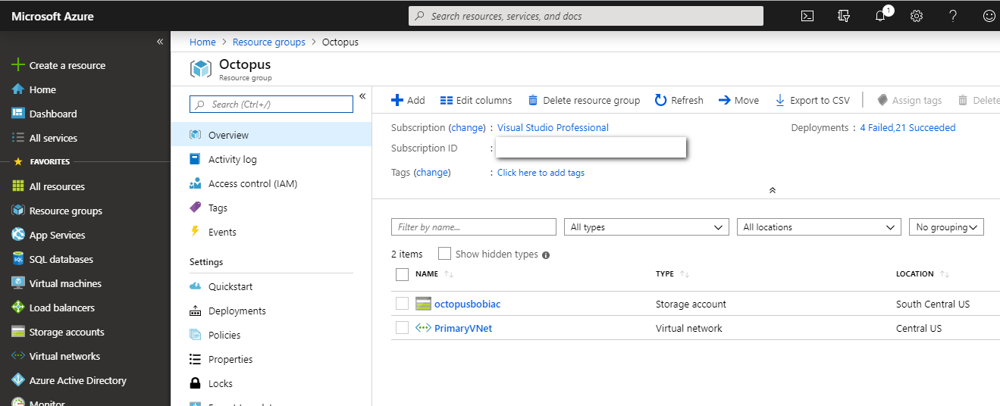

A virtual network in that resource group to store the subnets to connect to.

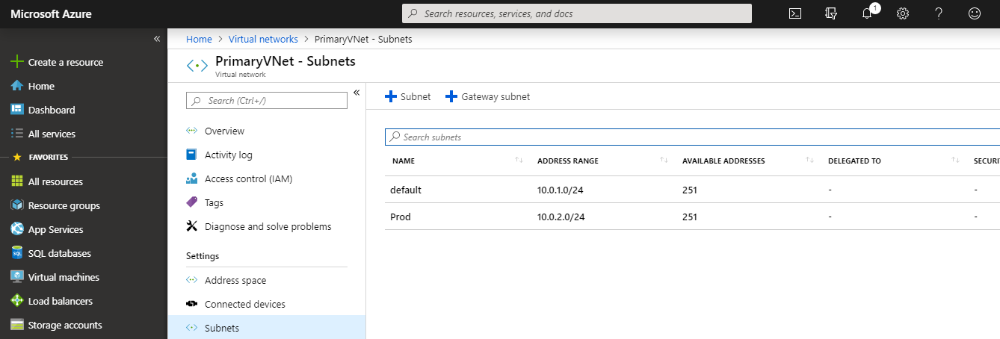

## Configure Octopus Deploy

With the prep work out of the way, it is time to configure Octopus Deploy.  For this guide, Octopus Deploy will handle spinning up and tearing down the new VMs for `Production.`  

### Create a Teardown Environment

Because Octopus Deploy will be handling all the teardown work, a new `Teardown` environment needs to be added to your environment list.  Creating a new environment will allow you to isolate those steps.  They will only run when you are ready to tear everything down.  The environment itself will not have any deployment targets.  The scripts to teardown your new infrastructure will run either on the Octopus Server or on a worker.

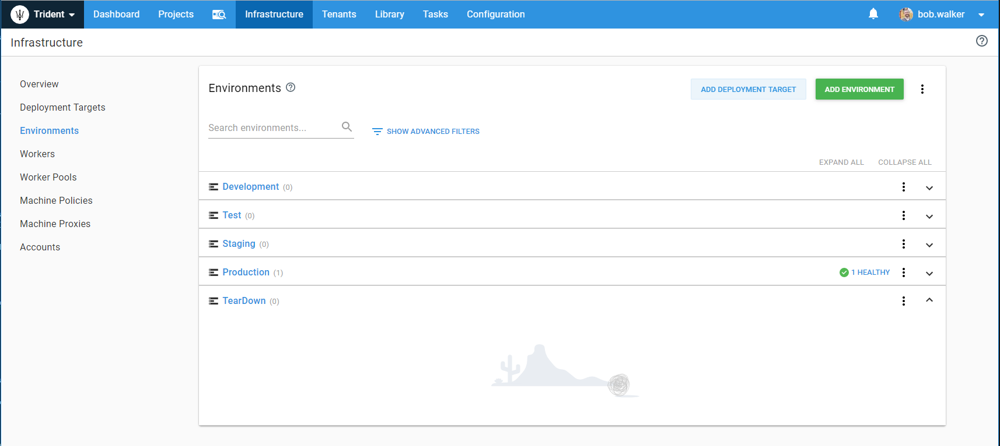

### Create a New Lifecycle

This guide is to spin up new machines in `Production.`  We only want to spin up new machines in `Production` and then tear them down when they are not needed.  To do that, we will need a new lifecycle.  

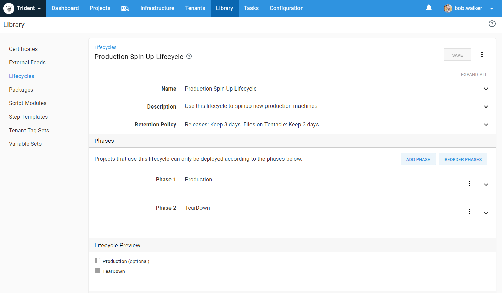

The `Production` environment should be marked as optional.  That way if anything were to go wrong during the spinup process we can easily delete everything and start over.  It is much easier to start fresh than it is to try to figure out which resources you have and which ones you need to still create.  Also, making `Production` optional will allow you to iterate through your creation scripts.  You want to be sure you can scale out `Production` the first time.  A good way to do that is to start fresh each time you run the scripts.  

### Create Variable Sets

[Variable sets](https://octopus.com/docs/deployment-process/variables/library-variable-sets) allow you to share values between projects.  We recommend creating multiple variable sets.  In the below screenshot there are two variable sets, one to store Azure specific values, and another to store global naming conventions.  

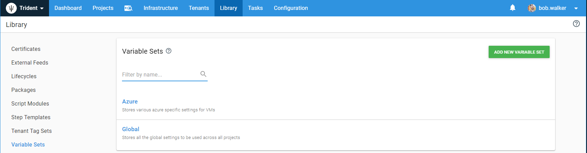

As you build out your process you will find yourself repeating the same variables over and over.  When that happens it is time to move the variable over to a variable set.  From the start, there are some variables which you can see make sense to put in those variable sets right away.

- VM Naming Template
- VM Admin Username
- VM Admin Password
- Resource Group or Cloud Formation Stack Name Templates
- Subnet names (if you need to worry about that)

### Configure Triggers

Because we are going to be scaling out production, we will need a trigger to watch for new targets.  When a new target is added to production we will want to redeploy the latest release to production.  To do this, go to the project which does the deployments for your application.  Then go to the triggers section and create a new deployment target trigger.

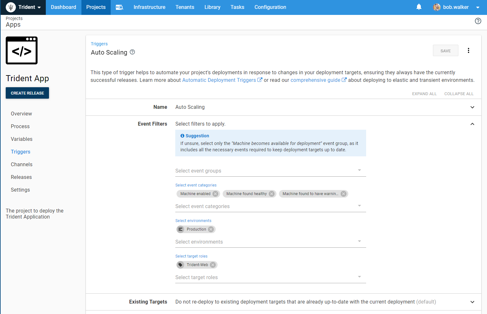

### Skip specific deployment steps during trigger deploy

We have manual interventions in our deployment process as well as a database deployment.  

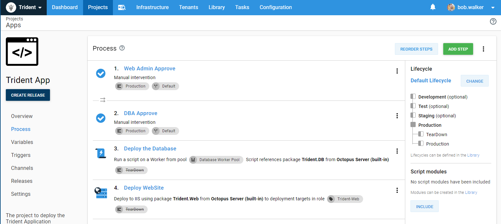

We do not want to re-run those specific steps when a trigger is deploying the code to a new server.  To stop that from happening, this run condition: `#{unless Octopus.Deployment.Trigger.Name}True#{/unless}` will work.  It is a bit of a double negative.  If the deployment was triggered manually by a person, or through a service account by a build server, the step will run.  If it is triggered by a trigger the step will be skipped.

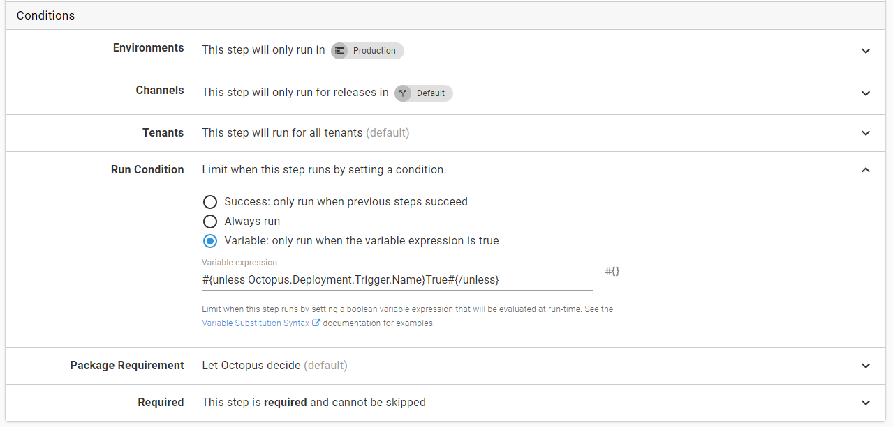

## IaC Octopus Project

All that work done above was to configure Octopus Deploy to support a new project to support this scenario.  It is now time to add a project which will scale out production.

We recommend having a separate project to scale up and down servers for production.  This will keep everything a lot cleaner and easier to maintain.  When you deploy your code to production you don't want to worry about accidentally scaling up a bunch of servers.  

The new project's process will create the new resources when it runs in `Production` and tears down those resources when it runs in `TearDown.`

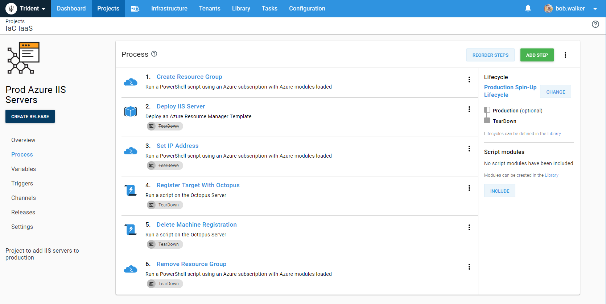

This repo includes samples for each step.

1. [Create Resource Group](arm/cliscripts/CreateResourceGroup.ps1)
2. [Deploy IIS Server](arm/templates/WindowsServer.json)
3. [Set IP Address](arm/cliscripts/GetIpAddressForRegistration.ps1)
4. [Register Target With Octopus](api/RegisterWindowsVM.ps1)
5. [Delete Machine Registration](api/DeregisterTarget.ps1)
6. [Remove Resource Group](arm/cliscripts/DeleteResourceGroup.ps1)

One thing very interesting about this is that project is very generic.  In theory it could be used to scale out any application, if they are running on Windows.  So that is what we did for this project, made it generic so it could be re-used.  First we went through and converted variables over to be prompted when it made sense.

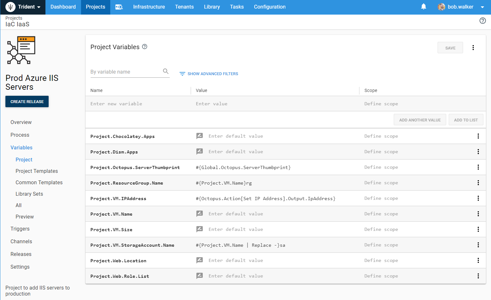

Also, make note of the output variable, `Project.VM.IPAddress.`  That is the variable which stores the IP Address from the `Set IP Address` step in the process.  That IP Address will be used by the step to register the tentacle with Octopus Deploy.

With that we created a new project to call this project using Octopus Deploy's [Deploy a Release step](https://octopus.com/docs/deployment-process/projects/coordinating-multiple-projects/deploy-release-step).  

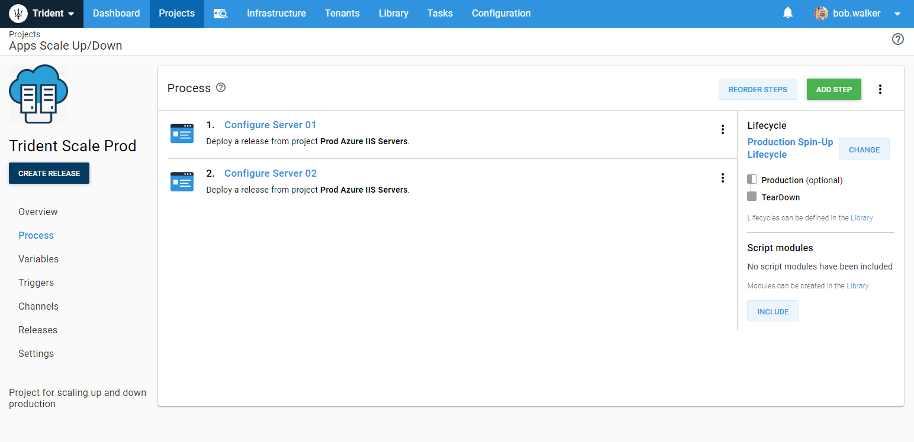

When we drill into the step we can see we are passing in the necessary variables to the project template.

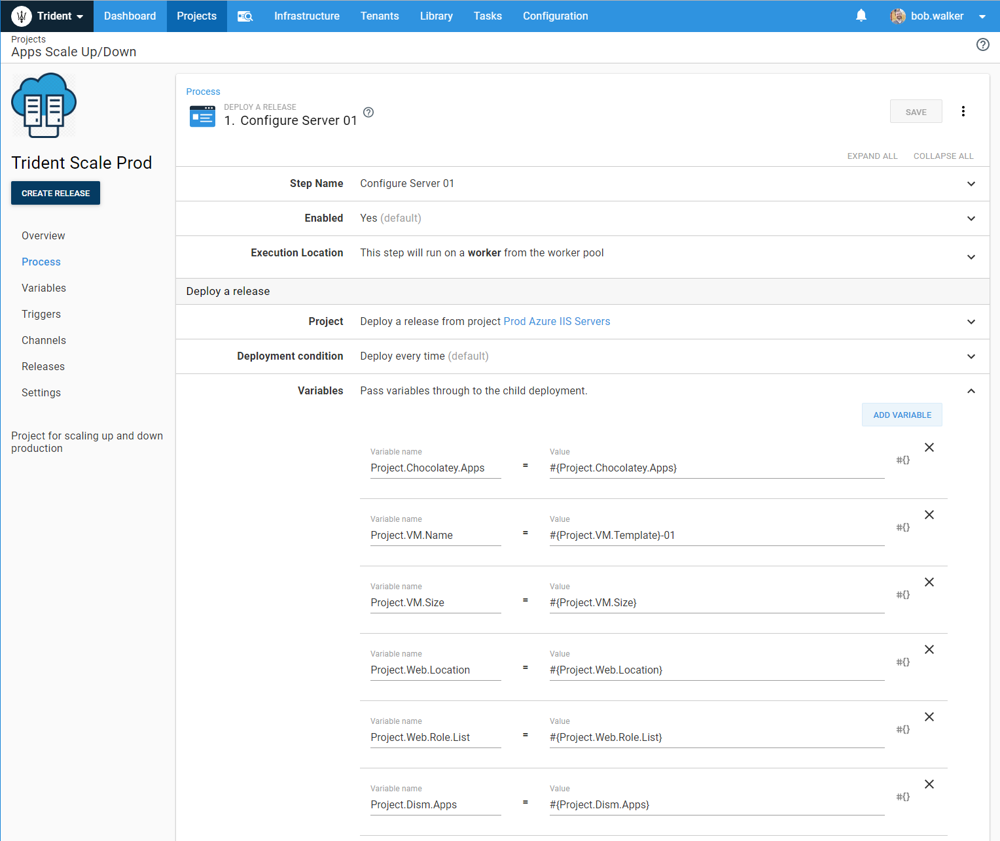

The variables being sent in are defined in this project.

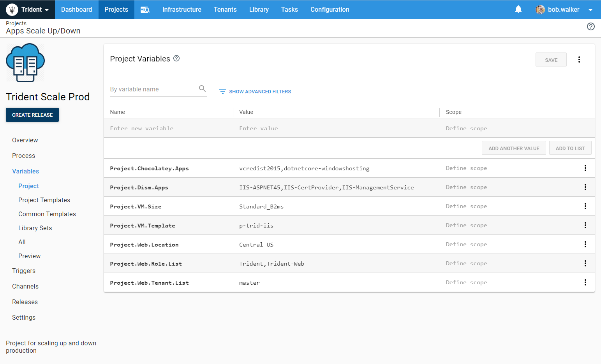

## Wrapping Up

And with that, you now have a project configured to spin up and down VMs for production.  This was a fairly simple project, you will most likely have a bit more complexity in your setup.  For example, this guide did not tackle load balancers.  